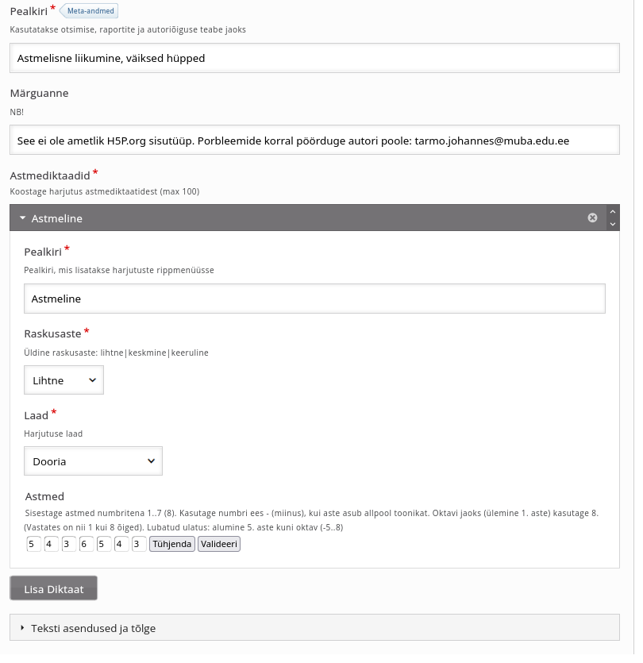
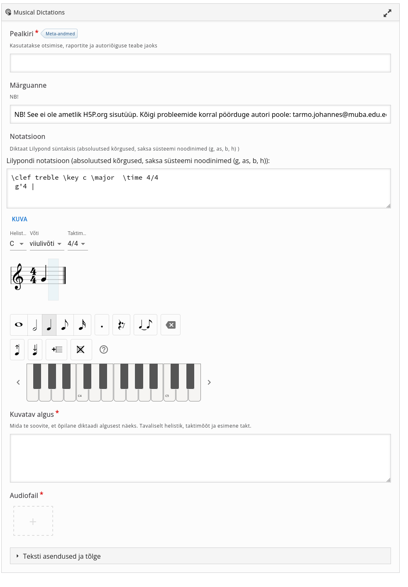

Creating Exercises with H5P-Solfege  Libraries
==========

## About

*H5P-Solfege* is a project to develop libraries for creating ear training exercises in  https://sisuloome.e-koolikott.ee/ or similar H5P content system.

The software is developed at Georg Ots Tallinna Music School, now Tallinn College of Music and Ballet for project "Digitaalse muusikateooria ja solfedžo õppevara täiustamine ja arendamine"   with the support of European Social Fund (Euroopa Sotsiaalfond).


Since e-koolikott is meant mostly for Estonian schools, the instructions below will be only in Estonian. The libraries can be used in Estonian, English and Russian though, if the platform supports it.

<br>

## Harjutuste loomine

Nende teemade kohta on ka videotutvustused:

[Astmediktaatide loomine](https://www.youtube.com/watch?v=WWGh_v6EX9Q&ab_channel=MUBA)

[Diktaatide loomine](https://www.youtube.com/watch?v=SIb7oxUOw2c&ab_channel=MUBA)

<br />

### Sisenemine e-koolikoti sisuloomesse


E-koolikoti sisuloome asub aaderssil: https://sisuloome.e-koolikott.ee/


Sisenemiseks on vajalik HarID (Haridus-ID) konto. Kui olete Tahvli, eKooli, Opiq jpm kasutaja, siis on see teil tõenäoliselt olemas. Kui mitte, looge konto aadressil https://harid.ee/et/users/sign_up


Kui olete sisenenud, vajutage nuppu "Loo uus materjal"


<br>

### Sisutüübi valimine

**H5P** on interaktiivse veebimaterjali loomise süsteem, millele e-koolikott on rajatud. H5P teeke (ingl.k *libraries*) nimetatakse sisutüüpideks.

**H5P-Solfege** võimaldab hetkel luua 2 (peatselt 3) tüüpi harjutusi -  **astmediktaadid** (*degree dictations*), **harmoonilised funktsioonid** (*harmonic functions*) (+ peatselt: meloodilised diktaadid).

Sisestage harjutuse pealkiri, mille järgi saab seda hiljem leida. Nt "Astmediktaadid - test"

Valige seejärel H5P Sisu tüüp. Otsingu ribale tuleb sisestada tüübi ingliskeelne nimetus või üks osa sellest. Nt *degree* või *harmon*

 


Klõpsake valitud tüübile ning avaneb vorm, nn *H5P-Editor*, mille abil saate harjutuse koostada. Vaatleme erinevaid tüüpe allpool eraldi.

<br>

### Astmediktaadid (Degree dictations)

Kõigepealt tuleb sisestada harjutuse pealkiri. Nt "Astmeline liikumine, väiksed hüpped"

Märguanne "See ei ole ametlik H5P.org sisutüüp. Probleemide korral pöörduge autori poole: tarmo.johannes@muba.edu.ee " tähendab, et tegemist ei ole H5P.org  enda välja töötatud sisutüübiga ning e-koolikott/H5P ei võta vastutust, kui selle juures on mingeid tõrkeid. Seda ei olnud võimalik kuvada kuidagi elegantsemalt.

Harjutus võib sisaldada üks või mitu astmediktaati. Need saate sisestada "Harjutuse andmed" all:

- konkreetse diktaadi pealkiri (läheb harjutuses rippmenüüsse). Nt "1" või "Astmeline" vms
- määratlege tunnetuslikult harjuse raskusaste oma sihtgruppi silmas pidades. See pole nii oluline - siin ei ole ühtset standardit.
- valige laad, nt "Dooria"
- sisestage astmed. Meloodia peab koosnema 7 noodist, so iga kast peab olema täidetud. Astmed tuleb sisestada numbritena - 1, 2, .. 8. 8 tähendab "ülemine 1". Vastuses on "1" selle koha peal õige, kuid süsteem ei teaks muidu, kumma 1. astmega on tegemist. Toonikas allapoole saab minna kuni 5. astmeni, selleks tuleb sisestada astmed miinusmärgiga: -7, -6, -5. Vastates, miinust pole vaja. Kui teete midagi valesti, siis see kastike märgitakse punasega. Kui kõik on korras, siis nuppu "Valideeri" tegelikult polegi vaja vajutada.
- Kui soovite sisestada järgmise meloodia, vajutage nuppu "Lisa diktaat" ning täitke sarnased väljad.
- "Teksti asendused ja tõlge" võite jätta nii nagu on või kui soovite lihvida mõne välja tõlget, saate seda siin teha.


 


Kui kõik on valmis, vajutage "Salvesta". Seejärel saate harjutust üle vaadata, läbi teha ning vajadusel sisse viia vajalikud muudatused/täiendused. (Nupp ülal -  "Muuda"). 

Et õpilane saaks seda harjutust teha, tuleb see avaldada. Selleks on kõige mugavam võimalus vajutada nuppu "Avalda e-koolikotis". Vt peatükk "Avaldamine e-koolikotis" allpool.


### Harmoonilised funktsioonid (Harmonic functions)

Seda tüüpi harjutuse sisuks on, et süsteem esitab väikse helifaili ning kasutaja peab taktide kaupa kirja panema, milline harmooniline funktsioon -  toonika, subdominant, dominant või mediant  - seal on.

Harjutuse koostaja peab seega kõigepealt valima ja ettevalmistama vastavad helifailid - kas ise salvestama või valima katkendeid olemasolevast muusikast.

Ka selle sisutüübi juures võib sisestada ühes harjutuses mitu erinevat funktsioonidiktaati. Selleks:

- andke igale diktaadile pealkiri, mis kuvatakse harjutuse juures rippmenüüs (võib olla ka lihtsatl "1", "2", "3" jne)
- seejärel sisestage funktsioonid tähtetega t, d, s, m taktide kaupa, üks sisestusväli vastab ühele taktile. Sobivad nii suur- kui väiketähed. Tihti on ühes taktis ainult üks funktsioon, aga kui neid on mitu (tüüpiliselt 2), siis tuleb lahtrisse sisestada mitu tähte, nt "t d", tühikud pole olulised, võib sisestada ka "td".
- laadige üles helifail. Veenduge, et teil on selle kasutamiseks õigus! (vaba litsentsiga, enda loodud helifail või olemasolevate teoste lühikesed katkendid)
- kui teil on võtta, võite lisada ka notatsiooni pildifailina (.jpg või .png vormingus).


Kui kõik on valmis, vajutage "Salvesta". Seejärel saate harjutust üle vaadata, läbi teha ning vajadusel sisse viia vajalikud muudatused/täiendused. (Nupp ülal -  "Muuda"). 

Et õpilane saaks seda harjutust teha, tuleb see avaldada. Selleks kõige mugavam võimalus on nupp "Avalda e-koolikotis".

<br>

### Meloodilised (muusikalised) diktaadid (Musical dictations)

Siin on mõeldud nö tavalisi diktaate, kus kasutaja peab kirja panema kuuldud meloodia. Harjutustes aluseks on helifail ning kasutaja peab kirja panema kuuldud meloodia, süsteem kontrollib tulemust ja näitab vigu.

Soovi korral vaadake ka [videotutvustust](https://www.youtube.com/watch?v=SIb7oxUOw2c&ab_channel=MUBA).

Harjutuse koostaja peab kõigepealt valima ja ettevalmistama vastava helifaili - kas ise salvestama või valima katkendi olemasolevast muusikast.

E-koolikoti sisuloomes valige sisutüübiks **Musical Dictations**.

Sisetage harjutuse pealkiri, laadige üles helifail ning sisestage korrektne notatsioon. Selleks on kolm võimalust: 1) kasutada klaveriklahvistiku sarnast vidinat ning kontrollnuppe 2) kasutada vastavaid klahvikombinatsioone 3) sisestada notatsioon tekstiliselt Lilypond formaadis. Neist kolmest lähemalt allpool.  Alustades näeb ekraanipilt välja nii:



#### Notatsiooni sisestamine

Valige menüüst sobiv võti (valikus viiuli- ja bassivõti), helistik ning taktimõõt. Neid võib deklareerida ka otse, Lilypond notatsiooni väljas.

1. Klahviatuur ja kontrollnupud

Valige esmalt noodi vältus, seejärel vajutage sobivale klaveriklaviatuuri klahvile. Pausi sisestamiseks klõpsake klahvi asemel pausi nupule. Kui vältus on punktiga, saate selle lisada punkti nupu abil peale noodi sisestamist (nupp kehtib viimasele või hetkel valitud noodile).

Takte saate lisada takti lisamise nupu abil, süsteem ise taktimõõtu ja taktide täitumist ei kontrolli. 

Kui soovite nooti muuta, klõpsake sellele ning sisestage uus kõrgus või vältus.  Kui soovite noote lisada takti keskele, klõpsake alale kahe noodi vahel. Notatsioonikursor muutub lisamisrežiimis heleroheliseks. Kustutamisnupu abil saate kustutada viimase noodi, "Eemalda takt" nupu abil kogu takti.

2. Klahvikombinatsioonid (_shortcuts_)

Väikese vilumuse korral on notatsiooni sisestamine kiirem klahvikombinatsioonide abil. Võite kasutada järgmisi klahvikombinatsioone, et sisestada või muuta noote:

_NB! Et klahvikombinatsioonid aktiveerida, klõpsake esmalt noodijoonestikule_!

- Noodid: klahvid c, d, e, f, g, a, b, h. Suurtähed (C, D, jne) annavad 2. oktavi, ctrl + noodinimi väikse oktavi.
- Noot üles/alla, et lisada nt diees või bemoll (enharmoonilised vasted k.a.): nool üles või alla
- Vältused: 1 - täisnoot, 2 - poolnoot, 4 - veerandnoot, 8 - kaheksandik, 6 - kuueteistkümnendik
- Paus: r
- Punkt (lisa või eemalda): .
- Pide (lisa või eemalda): t
- Liikumine: nool paremale/vasakule liigub järgmise/eelmise noodi peale, ctrl+nool järmisesse/eelmisesse takti.

Klõpsa nootide vahele, et lisada noote takti keskel.

3. Tekstiline sisestus (Lilypond)

Diktaade notatsioon salvestatakse harjutuste juures alati teksti kujul, Lilypond formaadis. See on oluline, et võimalda ka vaegnägijatele diktaatide sisestamist ja kontrollimist.

Tekstiliseks sisestuseks on siin kasutusel levinud notatsiooni keel Lilypond (mis on ühtlasi väga võimalusterohke ja kaunis notatsiooniprogramm)  https://lilypond.org/. Muusikat õppinud inimesele peaks siin kasutatavad Lilypondi võimalused olema kergelt mõistetavad. Näiteks:

    \clef treble \key d \major  \time 4/4

määrab võtmeks viiulivõtme, helistikuks D duuri ning taktimõõduks 4/4

    \clef bass \key fis \minor  \time 6/8 

aga bassivõtme, fis molli, taktimõõdu 6/8.

**Noodinimedena** on siinkohal kasutusel nö saksa süsteem: _c, cis, des, d_ jne, _b, h, c_ (so mitte _bes, b_). 

**Pausi** korral on noodinime asemel **r** (_rest_)

Noot deklareeritakse kujul: noodinimi oktav [vältus] [punkt] [pide]. Osiste vahel ei tohi olla tühikut, nootide vahel peab olema tühik. 

**Oktavi** märk noodinime järel: 
- esimene oktav - ' (ülakoma) 
- teine oktav - '' (kaks ülakoma)
- kolmas oktav - ''' (kolm ülakoma)
- väike oktav -  mitte midagi, ainult noodi nimi
- suur oktav -  , (koma)
- kontraoktav -  ,, (kaks koma) 

**Vältus** sisestatakse numbrina - 1 -  täisnoot, 2 - poolnoot, 4 -  veerand, 8 -  kaheksandik, 16 -  kuueteistkümnendik. Kui vältus on punktiga, siis sinna järele . (punkt). Nt _c'4. d'8_  Kui vältus ei muutu, siis seda välja kirjutada ei ole vaja.

**Pide** närk on ~ (tilde). See lisatakse pide esimese noodi järele. 

**Taktijoon** on | (püstkriips). Lõpujoone sisestab süsteem ise.

Näiteks: "Rongisõit" B duuris (väikeste muudatustega, et lisada pide ja punkt ja paus):

``` 
\clef treble \key b \major  \time 2/4
b8 c' d' es' | f' f' f'4 |
r8 c' d' es'~ | es' f' f'4 |
es'8 es' es' es' | r d' d'4 |
c'4. c'8 | b16 b b b b4 
```

Kui olete Lilypond notatsiooni sisestanud, vajutage nuppu "Kuva" või Ctrl+Enter (Cmd+Enter) ning saate vaadata notatsiooni graafiliselt.  Kui olete teinud mõne vea, kuvatakse veateade.

#### Kuvatav algus    

Sisestage Lilypond notatsioonis, mida peaks kasutaja diktaadi alguses nägema. Tüüpiline on võti, helistik, taktimõõt, esimene noot. Et vältida vigu, kopeerige see ülalt Notatsioon väljast. Toodud "Rongisõidu" näite puhul näiteks:

```  
\clef treble \key b \major  \time 2/4
b8
``` 

Kui kõik on valmis, vajutage "Salvesta". Seejärel saate harjutust üle vaadata, läbi teha ning vajadusel sisse viia vajalikud muudatused/täiendused. (Nupp ülal -  "Muuda").

Et õpilane saaks seda harjutust teha, tuleb see avaldada. Selleks kõige mugavam võimalus on nupp "Avalda e-koolikotis".

<br>

## Avaldamine e-koolikotis

NB! On tähtis mõista, et **e-koolikott** ja **e-koolikoti sisuloome** on kaks eri keskkonda. **e-koolikott** on sisuliselt õppematerjalide kogu,  mis on loodud nendest harjutustest, mis on tehtud **sisuloomes**. Üks e-koolikoti materjal võib kombineerida endas mitu sisuloome harjutust, koondada neid peatükkidesse, lisada tutvustavat teksti.


Logige sisse e-koolikotti (nt HarID abil).

Mõistlik on hoida **e-koolikott** ja **sisuloome** kahes aknas või vahelehel eraldi lahti.

Vajutage nuppu "Lisa uus õppematerjal" või kui te olite vajutanud nuppu "Avalda e-koolis" sisuloomes, siis peakski olema uue materjali loomise vorm avatud. Sisestage materjali pealkiri ning kirjeldus.


Seejärel avage lahter "Lisa sisu". Kui te vajutasite Sisuloomes "Avalda e-koolikotis", peaks see olema eeltäidetud. Vastasel juhul tuleb kasutada nuppu "Poogi link", leidke sisuloome keskkonnas vastav harjutus, vajutage seal nuppu "Kopeeri link" ning kopeerige see e-koolikotis väljale "Lisa link", seejärel "Lisa"


Võite kasutada ka nuppusid "Lisa tekst", kui tahate midagi kommenteerida või "Lisa uus peatükk", kui materjal on ulatuslikum ja vajab liigendamist. "Poogi link" abil saate lisada veel teisi harjutusi. 


### Tee materjal lihtsamini leitavaks. 

Täita see osa, on väga oluline!

Valige otsingu järgi "muusika" õppekava, mille juurde see materjal sobib ning märkige ära vastavad kastikesed. Valige ka vähemalt üks üldpädevustest, nt "Kultuuri- ja väärtuspädevus". H5P-Solfege sisutüübid on kasutatavad ka pimedatele muusikaõppijatele, võite valida ka "Muu erivajadus".

Materjali tüüp peaks olema "Harjutus või tööleht", lisada võib ka
"Heli".


**NB!!!** Võtmesõnade juurde **märkige kindlasti "digitaalne õppevara - nutikas õppimine"** (ESF nõue)!Soovitav on lisada võtmesõna "solfedžo" ning harjutuse tüüp nt "diktaadid", "astmediktaadid", "harmoonilised funktsioonid", mille järgi on sama tüüpi harjutusi hiljem lihtsam leida.


Soovituslik on lisada pilt, mille järgi materjal ära tunneb, nt see:


Seejärel märkige ära kasitke, et nõustute *Creative Commons* litsentsiga ning salvestage materjal.

Ongi valmis!


